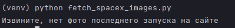

# tg_images
Get images from NASA, SpaceX and send to telegram channel

# Information
All images downloads to folder "/image"

# Install
First of all, install packages from **_requirements.txt_**:

```python pip -m install -r requirements.txt```

# Run
Download images from SpaceX (by id launch):

```python fetch_spacex_images.py 67```
> 67 - id launch (example)

Download images from SpaceX (last launch):

```python fetch_spacex_images.py```

Download 5 EPIC images from NASA:

```python fetch_nasa_epic_images.py```

Download 5 APOD images from NASA:

```python fetch_nasa_apod_images.py```

Automatic send images in the entered time interval from folder '/image'':

```python bot.py 4```
> 4 - time interval (hours)

# Errors
If no last launch image, you will see:



